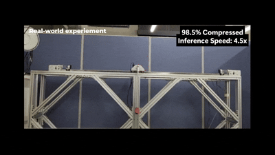

<div align="center">
  <h1>Bayesian Policy Distillation</h1>
  <h3>Towards Lightweight and Fast Neural Policy Networks</h3>
  
  <a href="https://www.python.org/">
    
  </a>
  &nbsp;&nbsp;
  <a href="https://pytorch.org/">
    
  </a>
  &nbsp;&nbsp;
  <a href="https://doi.org/10.1016/j.engappai.2025.113539">
    
  </a>
  &nbsp;&nbsp;
  <a href="https://www.elsevier.com/">
    
  </a>
  <br/><br/>
  
  
</div>

---

## Engineering Applications of Artificial Intelligence (EAAI 2026)
### PyTorch Implementation

This repository contains a PyTorch implementation of **Bayesian Policy Distillation (BPD)** from the paper:

> **Bayesian policy distillation: Towards lightweight and fast neural policy networks**  
> Jangwon Kim, Yoonsu Jang, Jonghyeok Park, Yoonhee Gil, Soohee Han  
> *Engineering Applications of Artificial Intelligence*, Volume 166, 2026

## 📄 Paper Link
> **DOI:** https://doi.org/10.1016/j.engappai.2025.113539  
> **Journal:** Engineering Applications of Artificial Intelligence

---

## Bayesian Policy Distillation

BPD achieves extreme policy compression through offline reinforcement learning by:
1. **Bayesian Neural Networks**: Uncertainty-driven dynamic weight pruning
2. **Sparse Variational Dropout**: Automatic sparsity induction via KL regularization
3. **Offline RL Framework**: Value optimization + behavior cloning
```math
\mathcal{L}_{BPD}(\theta, \alpha) = -\lambda Q_{\psi_1}(s, \pi_\omega(s)) + \frac{|\mathcal{D}|}{M}\sum_{m=1}^{M}(\pi_{\omega_m}(s_m) - a_m)^2 + \eta \cdot D_{KL}(q(\omega|\theta,\alpha) \| p(\omega))
```

**Key Results:**
- **~98% compression** (1.5-2.5% sparsity) while maintaining performance
- **4.5× faster inference** on embedded systems
- Successfully deployed on real inverted pendulum with **78% inference time reduction**

---

## Quick Start

### Basic Training
```bash
python main.py --env-name Hopper-v3 --level expert --random-seed 1
```

### Custom Configuration
```bash
python main.py \
    --env-name Walker2d-v3 \
    --level medium \
    --student-hidden-dims "(128, 128)" \
    --alpha-threshold 2 \
    --nu 4 \
    --h 0.5
```

### Available Environments
- `Hopper-v3`, `Walker2d-v3`, `HalfCheetah-v3`, `Ant-v3`

### Teacher Policy Levels
- `expert`: High-performance teacher policy
- `medium`: Moderate-performance teacher policy

---

## Key Hyperparameters

| Parameter | Default | Description |
|-----------|---------|-------------|
| `--student-hidden-dims` | (128, 128) | Student network hidden layer sizes |
| `--alpha-threshold` | 2 | Pruning threshold for log(α) (higher = less compression) |
| `--nu` | 4 | KL weight annealing speed |
| `--h` | 0.5 | Q-value loss coefficient |
| `--batch-size` | 256 | Mini-batch size |
| `--max-teaching-count` | 1000000 | Total training iterations |
| `--eval-freq` | 5000 | Evaluation frequency |

**Adjusting Compression:**
- `--alpha-threshold 3-4`: Conservative pruning
- `--alpha-threshold 2`: Balanced [default] 
- `--alpha-threshold 1`: Aggressive pruning

---

## Results

### MuJoCo Benchmark (Expert Teacher)

| Environment | Teacher | BPD (Ours) | Sparsity | Compression |
|------------|---------|------------|----------|-------------|
| Ant-v3 | 5364 | 5455 | 2.40% | **41.7×** |
| Walker2d-v3 | 5357 | 4817 | 1.68% | **59.5×** |
| Hopper-v3 | 3583 | 3134 | 1.35% | **74.1×** |
| HalfCheetah-v3 | 11432 | 10355 | 2.21% | **45.2×** |

### Real Hardware (Inverted Pendulum)
- **Inference**: 1.36ms → 0.30ms (**4.5× faster**)
- **Memory**: 290.82KB → 4.43KB (**98.5% reduction**)
- **Parameters**: 72,705 → 1,108 (**65.6× compression**)

---

## Code Structure
```
├── main.py              # Training script
├── BPD.py               # BPD agent
├── network.py           # Policy & critic networks
├── layer.py             # LinearSVDO (Bayesian layer)
├── SGVLB.py             # Loss computation
├── replay_memory.py     # Replay buffer
├── utils.py             # Utilities
└── logger.py            # Logging
```

---

## Citation
```bibtex
@article{kim2026bayesian,
  title={Bayesian policy distillation: Towards lightweight and fast neural policy networks},
  author={Kim, Jangwon and Jang, Yoonsu and Park, Jonghyeok and Gil, Yoonhee and Han, Soohee},
  journal={Engineering Applications of Artificial Intelligence},
  volume={166},
  pages={113539},
  year={2026},
  publisher={Elsevier}
}
```
